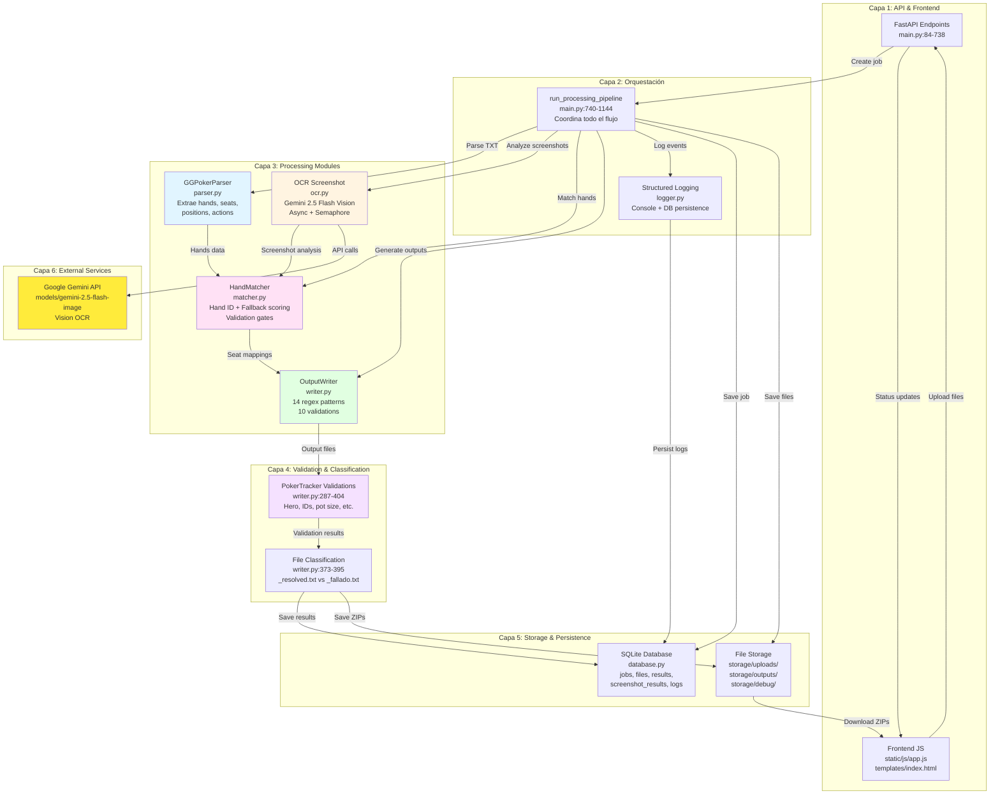
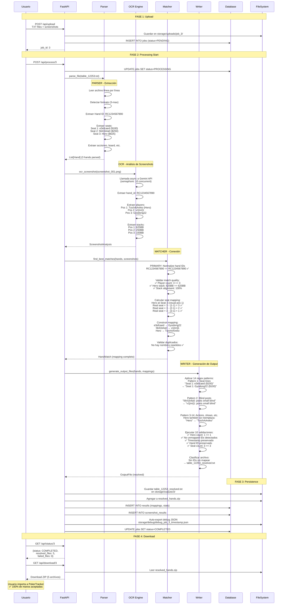

# GGRevealer - Visualizaciones del Workflow Completo

Este documento contiene tres diagramas complementarios que explican cómo funciona GGRevealer de principio a fin.

**Cómo visualizar estos diagramas:**
- **VS Code**: Instalar extensión "Markdown Preview Mermaid Support" o "Mermaid Preview"
- **GitHub**: Los diagramas Mermaid se renderizan automáticamente
- **Online**: Copiar el código a https://mermaid.live

---

## 1. Diagrama de Flujo (Flowchart) - Orden Secuencial

Este diagrama muestra el flujo completo del pipeline desde que subes archivos hasta que descargas los resultados.

```mermaid
flowchart TD
    Start([Usuario sube archivos]) --> Upload[POST /api/upload<br/>Guarda TXT + Screenshots<br/>en storage/uploads/job_id/]
    Upload --> CreateJob[Crea Job en DB<br/>Status: PENDING]
    CreateJob --> WaitProcess[Usuario hace click<br/>en Procesar]

    WaitProcess --> ProcessStart[POST /api/process/job_id<br/>Status: PROCESSING]
    ProcessStart --> Parse[PARSER<br/>GGPokerParser.parse_file<br/>Extrae hands, seats, actions]

    Parse --> OCRStart{¿Hay screenshots?}
    OCRStart -->|Sí| OCRParallel[OCR PARALELO<br/>10 screenshots simultáneos<br/>Gemini Vision API]
    OCRStart -->|No| NoOCR[Continuar sin OCR]

    OCRParallel --> OCRResult[ScreenshotAnalysis<br/>hand_id, players, positions<br/>hero_cards, board]
    NoOCR --> MatchStart
    OCRResult --> MatchStart

    MatchStart[MATCHER<br/>find_best_matches] --> HandIDMatch{¿Hand ID match?}
    HandIDMatch -->|Sí| ValidateMatch[Validar match quality<br/>Player count, stacks, alignment]
    HandIDMatch -->|No| FallbackScore[Fallback Scoring System<br/>Hero cards: 40pts<br/>Board: 30pts<br/>Position: 15pts<br/>Names: 10pts<br/>Stack: 5pts]

    FallbackScore --> ScoreCheck{Score >= 70?}
    ScoreCheck -->|Sí| ValidateMatch
    ScoreCheck -->|No| NoMatch[Sin match]

    ValidateMatch --> ValidationPass{¿Validación OK?}
    ValidationPass -->|Sí| BuildMapping[Construir seat mapping<br/>anonymized_id → real_name]
    ValidationPass -->|No| NoMatch

    BuildMapping --> DuplicateCheck{¿Nombres duplicados<br/>en mismo hand?}
    DuplicateCheck -->|Sí| RejectMatch[Rechazar match<br/>Mapping vacío]
    DuplicateCheck -->|No| ValidMapping[Mapping válido]

    NoMatch --> ContinuePipeline
    RejectMatch --> ContinuePipeline
    ValidMapping --> ContinuePipeline

    ContinuePipeline[Continuar con todos los hands] --> Writer[WRITER<br/>generate_output_files]

    Writer --> RegexReplace[14 Regex Patterns<br/>Reemplazar IDs por nombres<br/>Hero también se reemplaza]

    RegexReplace --> Validate10[10 Validaciones PT4<br/>1. Hero count<br/>2. Line count<br/>3. Hand ID<br/>4. Timestamp<br/>5. Currency<br/>6. Summary<br/>7. Table name<br/>8. Seat count<br/>9. Chip format<br/>10. Unmapped IDs]

    Validate10 --> DetectUnmapped{¿Tiene IDs<br/>sin mapear?}

    DetectUnmapped -->|Sí| ClassifyFailed[Clasificar como<br/>table_fallado.txt<br/>Agregar a fallidos.zip]
    DetectUnmapped -->|No| ClassifyResolved[Clasificar como<br/>table_resolved.txt<br/>Agregar a resolved_hands.zip]

    ClassifyFailed --> CreateZIPs
    ClassifyResolved --> CreateZIPs

    CreateZIPs[Crear archivos ZIP<br/>resolved_hands.zip<br/>fallidos.zip] --> SaveDB[Guardar en DB<br/>results, screenshot_results<br/>statistics, logs]

    SaveDB --> AutoExport[Auto-export debug JSON<br/>storage/debug/debug_job_id_timestamp.json]

    AutoExport --> StatusCheck{¿Proceso exitoso?}

    StatusCheck -->|Sí| Success[Status: COMPLETED<br/>Usuario descarga ZIPs]
    StatusCheck -->|No| Failed[Status: FAILED<br/>UI muestra errores<br/>Genera debug prompt con AI]

    Success --> End([Fin])
    Failed --> End

    style Parse fill:#e1f5ff
    style OCRParallel fill:#fff4e1
    style MatchStart fill:#ffe1f5
    style Writer fill:#e1ffe1
    style Validate10 fill:#f5e1ff
    style Success fill:#c8e6c9
    style Failed fill:#ffcdd2
```



**Leyenda de colores:**
- 🔵 Azul: Parser (extracción de datos)
- 🟡 Amarillo: OCR (Google Gemini Vision)
- 🟣 Rosa: Matcher (conexión hands ↔ screenshots)
- 🟢 Verde: Writer (generación de outputs)
- 🟪 Púrpura: Validaciones
- ✅ Verde claro: Éxito
- ❌ Rojo claro: Error

---

## 2. Diagrama de Arquitectura (Layered) - Estructura Modular

Este diagrama muestra cómo están organizados los módulos y cómo los datos fluyen entre capas.



**Flujo de datos resumido:**
1. **Input**: Usuario sube archivos → API guarda en FileSystem
2. **Processing**: Pipeline coordina Parser → OCR → Matcher → Writer
3. **Validation**: Writer valida outputs contra reglas de PokerTracker
4. **Classification**: Files se clasifican en resolved/fallado según unmapped IDs
5. **Persistence**: Results, logs, stats se guardan en DB + FileSystem
6. **Output**: Usuario descarga ZIPs desde FileSystem

---

## 3. Diagrama de Secuencia (Timeline) - Transformación de Datos

Este diagrama muestra cómo los datos se transforman paso a paso con ejemplos reales.



**Ejemplo de transformación completa:**

```
INPUT (TXT):
PokerStars Hand #RC1234567890: Hold'em No Limit ($1/$2 USD) - 2025/09/15 14:30:00
Table 'Alpha' 3-max Seat #1 is the button
Seat 1: e3efcaed ($100 in chips)
Seat 2: 5641b4a0 ($250 in chips)
Seat 3: Hero ($625 in chips)
e3efcaed: posts small blind $1
5641b4a0: posts big blind $2
*** HOLE CARDS ***
Dealt to Hero [Kh Kd]
e3efcaed: raises $4 to $6
...

INPUT (Screenshot):
[Screenshot PNG con overlay de PokerCraft]
- Hand ID visible: RC1234567890
- 3 jugadores visibles
- Posición 1 (abajo): TuichAAreko - 625BB
- Posición 2 (izq): v1[nn]1 - 250BB
- Posición 3 (arriba): Gyodong22 - 100BB

PROCESSING:
1. Parser extrae: e3efcaed, 5641b4a0, Hero
2. OCR extrae: TuichAAreko, v1[nn]1, Gyodong22
3. Matcher conecta: Hand ID match ✅
4. Matcher calcula posiciones reales (Hero=Seat 3)
5. Matcher crea mapping: e3efcaed→Gyodong22, 5641b4a0→v1[nn]1
6. Writer aplica 14 regex para reemplazar

OUTPUT (Resolved TXT):
PokerStars Hand #RC1234567890: Hold'em No Limit ($1/$2 USD) - 2025/09/15 14:30:00
Table 'Alpha' 3-max Seat #1 is the button
Seat 1: Gyodong22 ($100 in chips)
Seat 2: v1[nn]1 ($250 in chips)
Seat 3: Hero ($625 in chips)
Gyodong22: posts small blind $1
v1[nn]1: posts big blind $2
*** HOLE CARDS ***
Dealt to Hero [Kh Kd]
Gyodong22: raises $4 to $6
...
```

---

## Resumen de Componentes Críticos

### Parser (parser.py)
**Input**: Archivo TXT con hand histories
**Output**: `List[Hand]` con estructura:
- `hand_id`: String (e.g., "RC1234567890")
- `seats`: List[Seat] con `seat_number`, `player_id`, `stack`
- `positions`: Dict con "button", "small_blind", "big_blind"
- `actions`: List[Action] con street, player, action_type, amount
- `board_cards`: Dict con flop/turn/river

### OCR (ocr.py)
**Input**: Archivo PNG (screenshot de PokerCraft)
**Output**: `ScreenshotAnalysis` con:
- `hand_id`: String extraído del screenshot
- `players`: List[PlayerInfo] con `name`, `position`, `stack`
- `hero_cards`: String (e.g., "Kh Kd")
- `board_cards`: String (e.g., "Ah 9s 2c")
**Detalles técnicos**:
- Modelo: `models/gemini-2.5-flash-image`
- Paralelización: 10 requests simultáneas (asyncio.Semaphore)
- Prompt: 78 líneas optimizadas

### Matcher (matcher.py)
**Input**: `List[Hand]` + `List[ScreenshotAnalysis]`
**Output**: `List[HandMatch]` con mappings
**Estrategia de matching**:
1. **PRIMARY**: Hand ID normalizado (99.9% accuracy)
2. **LEGACY**: Hand ID en filename del screenshot
3. **FALLBACK**: Scoring system (threshold: 70 points)
   - Hero cards: 40 pts
   - Board: 30 pts
   - Position: 15 pts
   - Names: 10 pts
   - Stack: 5 pts
**Validaciones pre-match**:
- Player count match
- Hero stack ±25% tolerance
- General stack alignment ≥50%

### Writer (writer.py)
**Input**: `List[Hand]` + `Dict[str, str]` (mappings)
**Output**: Archivos TXT de-anonimizados
**14 Regex Patterns** (orden crítico):
1. Seat lines: `Seat X: PlayerID (stack in chips)`
2. Blind posts: `PlayerID: posts small/big blind`
3. Actions with amounts: `PlayerID: calls/bets/raises $X`
4. Actions without amounts: `PlayerID: folds/checks`
5. All-in actions: `raises $X to $Y and is all-in`
6-14. Dealt to, collected, shows, mucks, summary, etc.
**10 Validations**:
1. Hero count unchanged (CRITICAL)
2. Line count ±2 variance
3. Hand ID unchanged
4. Timestamp unchanged
5. No `$$` symbols
6. Summary section preserved
7. Table name unchanged
8. Seat count match
9. Chip value count
10. No unmapped IDs (CRITICAL)

---

## Casos Especiales y Edge Cases

### 1. PokerCraft Visual Position Mapping
**Problema**: PokerCraft siempre muestra Hero en posición visual 1 (abajo), independientemente del seat real.

**Solución**: Cálculo counter-clockwise en `matcher.py:260-341`:
```python
real_seat = hero_seat - (visual_position - 1)
if real_seat < 1:
    real_seat += total_seats  # Wrap-around
```

**Ejemplo (Hero at Seat 3 in 3-max)**:
- Visual Pos 1 → Real Seat 3 (Hero)
- Visual Pos 2 → Real Seat 2
- Visual Pos 3 → Real Seat 1

### 2. Duplicate Player Name Detection
**Problema**: Mismo nombre asignado a múltiples seats en un mismo hand.

**Solución**: `_build_seat_mapping()` valida duplicados y retorna mapping vacío si los detecta.

**Resultado**: Match rechazado, hand queda sin mapear (mejor que corrupto).

### 3. Hand ID Normalization
**Problema**: OCR puede omitir prefijos (e.g., "SG", "HH", "MT").

**Solución**: `_normalize_hand_id()` remueve prefijos antes de comparar:
```python
def _normalize_hand_id(hand_id: str) -> str:
    prefixes = ["SG", "HH", "MT", "TT", "RC", "OM"]
    for prefix in prefixes:
        if hand_id.startswith(prefix):
            return hand_id[len(prefix):]
    return hand_id
```

### 4. Fallback Matching con Validación Estricta
**Escenario**: Hand ID no disponible → Usar scoring system
**Validaciones aplicadas ANTES de aceptar match**:
- Player count: Hand seats == Screenshot players
- Hero stack: ±25% tolerance
- Stack alignment: ≥50% de stacks dentro de ±30%
**Threshold**: 70 points (aumentado desde 50)

### 5. Clasificación de Archivos
**Criterio**: Presencia de unmapped IDs (pattern: `\b[a-f0-9]{6,8}\b`)
- **0 unmapped IDs** → `_resolved.txt` → `resolved_hands.zip` ✅
- **1+ unmapped IDs** → `_fallado.txt` → `fallidos.zip` ⚠️

**Importante**: TODOS los hands se incluyen en output (nunca se pierden hands).

---

## Debugging Flow

### Cuando algo falla

1. **Auto-export de debug JSON** (automático al final del job):
   - Archivo: `storage/debug/debug_job_{id}_{timestamp}.json`
   - Contiene: Job info, logs, screenshot results, stats, errors

2. **AI-powered debugging prompt** (manual):
   - Endpoint: `POST /api/debug/{job_id}/generate-prompt`
   - Usa Gemini 2.5 Flash para analizar métricas
   - Genera prompt específico para Claude Code
   - Incluye referencia al debug JSON auto-exportado

3. **UI Features**:
   - Botón "Regenerar": Retry prompt generation
   - Botón "Copiar": Copy prompt to clipboard
   - Debug prompt se muestra automáticamente en errores

### Información de debug disponible

**Endpoint**: `GET /api/debug/{job_id}`

**Retorna**:
- Job details (status, timestamps, file counts)
- All uploaded files (TXT + screenshots)
- Processing results (mappings, stats, errors)
- Screenshot-level results (OCR errors, match counts)
- Structured logs (filtrados por level)

**Logs estructurados**:
```
[JOB 3] [INFO] Starting processing...
[JOB 3] [INFO] Parsed 147 hands from 5 files
[JOB 3] [INFO] OCR completed: 265/265 screenshots analyzed
[JOB 3] [INFO] Found 208 matches (78.5% match rate)
[JOB 3] [WARNING] Unmapped seats in hand RC123: Seat 2 (abc123)
[JOB 3] [INFO] Generated 5 resolved files, 0 failed files
[JOB 3] [INFO] Auto-exported debug JSON to storage/debug/debug_job_3_20250915_143000.json
```

---

## Métricas de Performance

### Match Rate Calculation
```python
match_rate = (matched_screenshots / total_screenshots) * 100
```

**Benchmark**:
- **Hand ID matches**: 99.9% accuracy
- **Fallback matches**: ~70-80% accuracy (con validación estricta)
- **Overall**: 85-95% match rate esperado

### OCR Success Rate
```python
ocr_success_rate = (successful_ocr / total_screenshots) * 100
```

**Benchmark**: 95-98% success rate (Gemini 2.5 Flash Vision)

### De-anonymization Rate
```python
deanon_rate = (resolved_files / total_files) * 100
```

**Benchmark**:
- Con screenshots suficientes: >95%
- Con screenshots parciales: 60-80%

### Processing Time
**Estimado por fase**:
- Parser: ~0.1s per file (fast)
- OCR: ~2-3s per screenshot (API latency)
- Matcher: ~0.01s per hand (fast)
- Writer: ~0.1s per file (fast)

**Total**: Dominado por OCR (10 screenshots paralelos = ~30s para 100 screenshots)

---

## Referencias Rápidas

### Archivos clave
- **main.py:740-1144**: Pipeline completo
- **parser.py**: Extracción de hand histories
- **ocr.py:46-117**: Prompt de Gemini (78 líneas)
- **matcher.py:11-240**: Matching logic + validaciones
- **writer.py:174-282**: 14 regex patterns
- **writer.py:287-404**: 10 validations
- **database.py**: Schema de tablas (jobs, files, results, logs)

### Comandos útiles
```bash
# Iniciar servidor
python main.py

# Ver logs en tiempo real
tail -f storage/logs/job_3.log  # Si existe

# Inspeccionar DB
sqlite3 ggrevealer.db "SELECT * FROM jobs;"
sqlite3 ggrevealer.db "SELECT * FROM logs WHERE job_id=3 ORDER BY timestamp DESC;"

# Ver debug JSON
cat storage/debug/debug_job_3_*.json | jq .

# Test matching
python test_job3_matching.py
```

---

## Glosario

- **Anonymized ID**: 6-8 character hex string (e.g., "e3efcaed") usado por GGPoker
- **Hand ID**: Unique identifier (e.g., "RC1234567890") que identifica una mano
- **Seat mapping**: Diccionario `{anonymized_id: real_name}`
- **Hero**: El jugador desde cuya perspectiva se grabó la hand history (SÍ se reemplaza con el nombre real extraído del OCR)
- **Resolved file**: Archivo 100% de-anonimizado, listo para PokerTracker
- **Failed file** (`_fallado.txt`): Archivo con al menos 1 ID sin mapear (necesita más screenshots)
- **OCR**: Optical Character Recognition (extracción de texto de imágenes)
- **Match quality**: Validación de que un screenshot realmente corresponde a un hand
- **Fallback matching**: Sistema de scoring cuando Hand ID no está disponible

---

**Última actualización**: 2025-09-15 (Job #3 case study)
